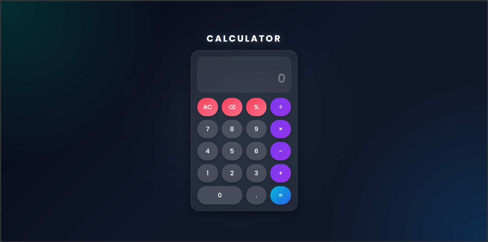

# Responsive Calculator

## Project Description

This project is a Responsive Calculator developed using HTML, CSS, and JavaScript. It performs basic arithmetic operations and provides a clean, user-friendly, and responsive interface that works across different devices.

## Technologies Used

- HTML5
- CSS3
- JavaScript

## Features

- Addition, Subtraction, Multiplication, and Division
- Responsive Design
- User-Friendly Interface
- Real-Time Calculations
- Mobile-Friendly Layout
- Clean and Modern Design

## Project Structure

```
Responsive-Calculator/
│
├── index.html
├── style.css
├── script.js
└── assets/
```

## How to Run

1. Clone the repository
2. Open `index.html` in your browser
3. Use the calculator to perform calculations

## Screenshots

### Calculator Interface



## Learning Outcomes

- HTML Structure
- CSS Styling
- Responsive Web Design
- JavaScript Event Handling
- DOM Manipulation

## Author

**Sonu**
